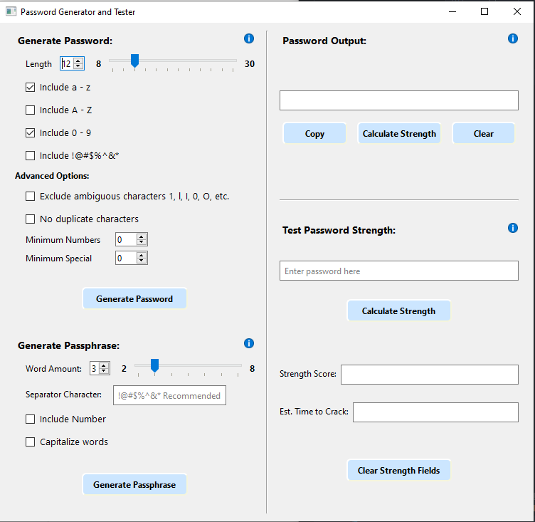
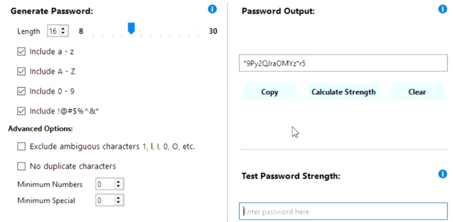
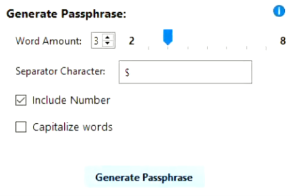
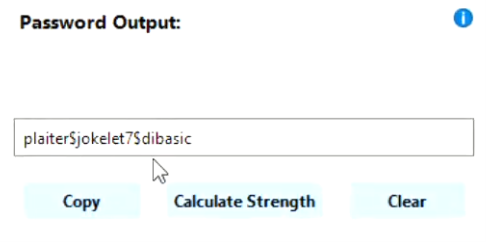
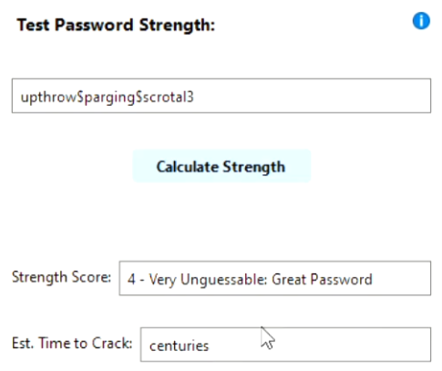
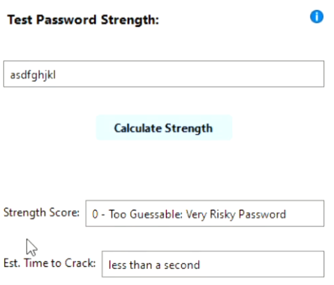

<!-- Improved compatibility of back to top link: See: https://github.com/othneildrew/Best-README-Template/pull/73 -->

<!-- Centered title section with descriptive lines -->

  <!-- Badges -->
  

    
    
    
  

   
  <!-- Titles and Subtitles -->
  <h1 align="center">Password Generator App</h1>
  

    <b>A PySide6 (Qt for Python) Desktop Application Using Microservices to Generate Passwords and Test their Strength</b>
  

  

    Winter 2022 · <a href="https://ecampus.oregonstate.edu/soc/ecatalog/ecoursedetail.htm?subject=CS&coursenumber=361&termcode=ALL">CS 361 Software Engineering I</a> · Oregon State University
  

   

<!-- Table of Contents -->

  
Table of Contents

    
  - [Project Description](#project-description)
  - [Technologies Used](#technologies-used)
  - [Features](#features)
  - [Usage](#usage)
  - [Skills Applied](#skills-applied)
  - [Acknowledgments](#acknowledgements)

<!-- Project Description -->
## Project Description

Password Generator is a Python desktop application for users to generate passwords and test password strength. It is the culmination of a term-long group project using Agile methods to design and develop an application implemented using a microservices architecture. Each person on the team had to create their own individual project as well as a microservice for one or more of the team's applications. The microservices were implemented as socket server applications, which meant that our main projects were their clients. 

Project development was organized into sprints, covering tasks such as defining requirements, designing UI, collaborating as a team on microservices, implementing a minimum viable product, service integration, and code evaluation and refactoring. Other Agile methods involved in this project's development were the use of task management systems, like [Trello][trello-url] or [Asana][asana-url], as scrum boards for sprints, spikes, and user stories.

<!-- Technologies Used -->
## Technologies Used

  - [![Python][Python]][Python-url]
  - [![pyside6][pyside6]][pyside6-url]
  - [![qt-style][qt-style]][qt-style-url]
  - [![socket][socket]][socket-url]
  - [![asana][asana]][asana-url]

<!-- Features -->
## Features

Password Generator offers an array of features for a user to interact with.
  - **Custom Password Generation**: Allows a user to generate a custom random-character password with customization options like length and the characters that will be used in generation.
  - **Passphrase Generation with Options**: Provides a way for users to generate passphrases, a string of random words, with options like number of words and a separator character for adding or removing complexity.
  - **Strength Testing**: Provides password strength estimation for users to test any password or passphrase for a strength score and an estimated time to crack.
  - **Clean and Simple GUI**: The application's user interface is uncomplicated and easy to use and understand so that any user can understand the application.
  - **Informational Tooltips**: Tooltips throughout the application guide users on the use of the application as well as how making certain selections can impact passwords.
  - **Microservices Architecture**: The application uses two different microservices via sockets that were created by two separate teammates. One gets a specified number of random words for passphrases, while the other uses [zxcvbn][zxcvbn-url], a password strength estimator written by Dropbox, for getting strength statistics. All other Python files except the GUI file were implemented with modularization in mind to fit a microservices architecture.

(<a href="#readme-top">back to top</a>)

<!-- Usage -->
## Usage

This project was designed to use two of my teammates' microservices that I no longer have access to so this project will not run unless I get access to them again or write them myself. The following is how the program could be used when everything was all together.

  - Main Program Window
    - A simple and intuitive GUI that gives the user plenty of useful information on program use without the need for a tutorial. The app's GUI is broken into four logical sections, Generate Password, Generate Passphrase, Password Output, and Test Password Strength. Each of those sections allow a user to do exactly as they are titled.

  </img>

  
  - Password Generation
    - Before generating a random-character password, choose a length, make character inclusion selections, and optionally add advanced options, then click on generate password to get a password. Hover over tooltips and options to get more information.
    - The password will then be displayed in the Password Output section for you to copy it, test it, or clear it.

  </img>

  - Passphrase Generation
    - When generating a random-word passphrase, choose how many words will be in it, what character will separate them, and decide if you want a number after a word and/or the words capitalized. Hover over tooltips and options to get more information.
    - The passphrase will then be displayed in the Password Output section.

  </img>
  </img>

  - Password Output
    - This section will display any generated passwords or passphrases the user generates. The password cannot be edited here in order to preserve the password. The only ways to remove the password from the output is to use the "Clear" button or to generate a new password.
    - The password can be highlighted and copied but the "Copy" button keeps the user from potentially missing a character when highlighting it.
    - The "Calculate Strength" button just saves the user from a few extra steps by automatically putting the password into the "Test Password Strength" section and calculating the strength.

  - Testing Password Strength
    - To test a password or passphrase, enter it into the input box and click "Calculate Strength". Any password can be tested here.
    - The application will the tell the user the strength on a scale from 0 (too guessable) to 4 (very unguessable) and the estimated time for it to be cracked.

  </img>
  </img>

(<a href="#readme-top">back to top</a>)

<!-- Skills Applied -->
## Skills Applied

  - Python programming with sockets and custom QWidget classes
  - Microservices architecture design and implementation
  - GUI implementation using PySide6 (Qt for Python)
  - Using Agile methods to implement steps of the SDLC
  - Application design via defining requirements and creating user stories
  - Class modeling using Unified Modeling Language and Sequence Diagrams
  - UI/UX Design via paper prototyping and cognitive style heuristics
  - Collaborative teamwork in a software engineering project
  - Code evaluation and refactoring

(<a href="#readme-top">back to top</a>)

<!-- Contact -->
## Contact

Alexander Lubrano - [lubrano.alexander@gmail.com][email] - [LinkedIn][linkedin-url]

Project Link: [https://github.com/lubranoa/CS361-Portfolio-Project][repo-url]

(<a href="#readme-top">back to top</a>)

<!-- Acknowledgements -->
## Acknowledgments

  - [Qt for Python (PySide6) Documentation][pyside6-url]
  - [Qt Style Sheets Documentation][qt-style-url]
  - [zxcvbn Password Strength Estimator by Dropbox][zxcvbn-url]
  - [Asana Task Management System][asana-url]
  - [Shields.io][shields-url]
  - [Simple Icons][icons-url]

(<a href="#readme-top">back to top</a>)

<!-- Markdown links -->
<!-- https://www.markdownguide.org/basic-syntax/#reference-style-links -->
[Python]: https://img.shields.io/badge/Python-3776AB?style=for-the-badge&logo=python&logoColor=ffd343
[Python-url]: https://www.python.org/

[pyside6]: https://img.shields.io/badge/PySide6_(Qt_for_Python)-grey?style=for-the-badge&logo=qt
[pyside6-url]: https://doc.qt.io/qtforpython-6/index.html

[qt-style]: https://img.shields.io/badge/Qt_Style_Sheets-grey?style=for-the-badge&logo=qt
[qt-style-url]: https://doc.qt.io/qt-6/stylesheet.html

[socket]: https://img.shields.io/badge/Python_sockets-3776AB?style=for-the-badge&logo=python&logoColor=ffd343
[socket-url]: https://docs.python.org/3/library/socket.html

[asana]: https://img.shields.io/badge/Asana_TSM-grey?style=for-the-badge&logo=asana
[asana-url]: https://asana.com/

[trello-url]: https://trello.com/
[zxcvbn-url]: https://github.com/dropbox/zxcvbn
[shields-url]: https://shields.io/
[icons-url]: https://simpleicons.org/

[email]: mailto:lubrano.alexander@gmail.com
[linkedin-url]: www.linkedin.com/in/lubrano-alexander
[repo-url]: https://github.com/lubranoa/CS361-Portfolio-Project